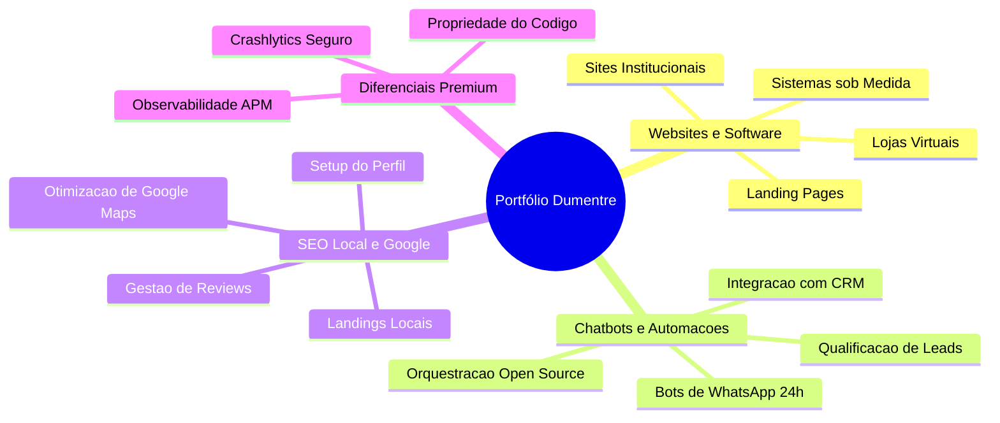

# Portfólio de Produtos e Serviços: Dumentre 🚀

Este documento consolida todos os produtos, serviços e diferenciais pesquisados e estruturados até o momento para serem oferecidos no site oficial da **Dumentre** (dumentre.com). 

O nosso posicionamento baseia-se na **sinergia entre design de alto padrão, engenharia de software robusta e observabilidade proativa**, cobrando preços premium pela qualidade técnica e de negócios que entregamos.

---

## 📂 Visão Geral do Portfólio

---

## 1. Websites & Softwares Customizados 🌐

Focado em criar presença digital rápida, de alta conversão e com código otimizado.

### Tipos de Entregáveis:
*   **Landing Pages:** Páginas de conversão focadas em campanhas de tráfego pago (Google/Meta Ads), com copywriting persuasivo e design responsivo premium.
*   **Sites Institucionais:** Portais completos para empresas que necessitam de credibilidade, apresentação de equipe, serviços e múltiplos pontos de contato.
*   **Lojas Virtuais (E-commerce):** Sistemas com catálogo, carrinho, cálculo de frete e checkout seguro integrados a gateways de pagamento.
*   **Sites One Page:** Estrutura compacta onde todo o conteúdo é scrollável em uma única tela, ideal para lançamentos rápidos ou profissionais liberais.
*   **Softwares e Apps sob Medida:** Aplicações web e mobile complexas com regras de negócio exclusivas, painéis de administração personalizados e conexões com APIs.

### O que vem incluso como Padrão (Inclusões de Valor):
*   **Copywriting focado em vendas:** Texto estruturado focado no ROI (retorno sobre investimento) do cliente, não apenas preenchimento de palavras.
*   **Design Responsivo Premium:** Visual customizado e adaptado perfeitamente para qualquer tamanho de tela (mobile-first).
*   **SEO Técnico Nativo:** Carregamento ultra-rápido, indexação correta e tags estruturadas para ranquear no Google.
*   **Suporte Pós-Lançamento:** Período de garantia técnica ativa (ex.: 90 dias) e treinamento prático para a gestão do site.

---

## 2. Chatbots, CRM & Automações de Atendimento 🤖

Focado na eficiência operacional, qualificação de leads e centralização de múltiplos canais.

### Benefícios Comerciais:
*   **Atendimento Comercial 24/7:** Um assistente virtual que responde clientes no WhatsApp a qualquer hora do dia ou da noite, eliminando o tempo de espera.
*   **Qualificação Inteligente de Leads:** Perguntas automatizadas de triagem para encaminhar apenas leads quentes/qualificados para a equipe humana.
*   **Redução de Custos Operacionais:** Capacidade de escalar o atendimento de milhares de chats diários mantendo o time de suporte reduzido.
*   **Omnichannel:** Integração unificada que centraliza interações do WhatsApp, Instagram Direct e Facebook Messenger.

### Diferencial Técnico (Orquestração Flexível):
*   Uso de orquestradores modernos de fluxos e IA (como **n8n** auto-hospedado ou **CrewAI** para agentes complexos), eliminando mensalidades caras por assento em plataformas fechadas.
*   Conexão total com CRMs de mercado (HubSpot, Salesforce, Kommo, Bitrix24) ou bancos de dados internos do cliente.
*   Garantia de **Propriedade dos Dados**, essencial para conformidade com a LGPD.

---

## 3. SEO Local & Presença no Google 📍

Focado em atrair clientes locais que estão buscando proativamente pelos serviços do cliente no bairro ou cidade.

### Principais Frentes de Trabalho:
*   **Criação/Reivindicação do Perfil da Empresa:** Registro e verificação da empresa no ecossistema do Google (Search e Maps).
*   **Otimização para Google Maps:** Posicionamento exato do pin, categorização correta do nicho, descrição comercial otimizada, horários e fotos de alta qualidade (fachada, equipe, bastidores).
*   **SEO Local On-Site:** Criação de Landing Pages específicas para bairros/cidades (ex.: `/clinica-odontologica-tatuape/`) contendo dados estruturados `LocalBusiness` para facilitar a leitura dos algoritmos.
*   **Gestão de Reputação:** Criação de links curtos, QR Codes e mensagens de pós-venda para incentivar ativamente a coleta de avaliações 5 estrelas reais dos clientes.
*   **Relatório Mensal de Métricas:** Acompanhamento de dados de ligações originadas, pedidos de rotas, termos de pesquisa que ativaram o perfil e cliques de visitas ao site.

---

## 🛡️ Os Nossos Diferenciais Premium (Transversais)

Estes são os diferenciais que a Dumentre oferece em **todos** os projetos e que servem como principais argumentos para justificar preços acima da média do mercado:

### A. Observabilidade e Monitoramento Ativo (O "Seguro de Performance")
*   Não apenas criamos o site ou chatbot e vamos embora. Integramos ferramentas de análise como **Firebase Performance, Crashlytics e Sentry**.
*   **Como vendemos:** *"Se o checkout do seu e-commerce quebrar às 22h ou o chatbot de atendimento parar de responder por uma falha de API, nós receberemos um alerta automático em nossos canais internos e agiremos para consertar antes mesmo que você perceba a queda nas vendas ou receba reclamações."*

### B. Propriedade do Código e Arquitetura Limpa
*   Sistemas desenvolvidos com linguagens modernas (TypeScript, Go) e limpas.
*   Diferente de agências WordPress/No-Code que prendem o cliente com plugins lentos e pesados, a Dumentre entrega o código 100% livre de *lock-in*. O cliente é dono real do produto.

### C. Manutenção Baseada em Dados
*   Usamos dados comportamentais do Firebase Analytics e de logs de uso para identificar gargalos de conversão, fazendo otimizações baseadas em fatos reais de uso e não em meros palpites estéticos.
